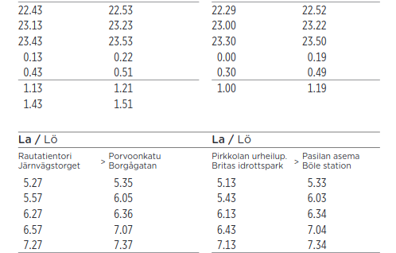

```{r init-libs-time echo=FALSE}
library(readr)
library(knitr)
library(magrittr)
```

# Time in transit data {#time}

Collective transport seems like a relatively simple thing: buses and other vehicles run from stop to stop, at scheduled clock times that pretty much remain the same from day to day.
Sometimes they run a bit ahead or late from the schedule.
In reality however, the temporal and spatial aspects of a transit system are more complicated than that.
I'll discuss my views of the temporal aspects in transit data modelling in this post, and the spatial aspects in the next post, Chapter \@ref(place).

::: {.noteblock data-latex=""}
I'll be using the Finnish date format like `1.12.2021` in this text.
It follows the order `day.month.year`.

Clock times, in turn, are expressed here as `hours:minutes`, `hours:minutes:seconds`, or `hours:minutes:seconds.milliseconds`.

Everything is handled in local Finnish time, unless stated otherwise.
:::

The word *time*, and its Finnish counterpart *aika*, is commonly used for multiple meanings.
In our organizational language at HSL, as well as elsewhere, each meaning is most often well understood from the context.
At the same time, there are many caveats and possibilities of at least slight misunderstandings with the concept.
Especially, in my view, when an experienced transit planner or analyst discusses our everyday business and related data models with a "newcomer", such as a software developer still onboarding a project, it typically takes a lot of time to unpack the exact definition of time in each context and to get both on the same page.
It often feels overwhelming for a newcomer to read all the meanings from a list of standards, for instance, and on the other hand, trying to skip that by simplifying things and making assumptions by "common sense" just seems to postpone the inevitable effort of confronting the complexity of time in transit modelling to a later phase.
At least at HSL, many essential definitions of time aspects - overlapping or contradictory ones as well - have not been thoroughly documented and officially agreed upon, which makes learning them pretty hard.
I think this is because most experts already share a similar mental model about them, and are able to use a common language understandable enough, and all of these have evolved over the years;
in the end, for an expert like this, it feels like there is always much more critical work to do than write down such "self-evident" things.
But then, every time we start a development project with external non-transit experts, or hire a new planner or analyst and wish to onboard them to the everyday work, we have to confront the fact that we have a whole lot of undocumented knowledge like this, and even the experienced ones do not in fact share *exactly* similar mental models.

Well, I try to contribute to explaining the dimensions of time in transit planning and modelling a bit.
My views are anything but exhaustive, though.

Let's think of a transit trip of HSL bus line 23, starting at 12:23 at Central Railway station on 11.12.2021.
It has a schedule - planned departure, possibly even separate arrival times, at each stop - and hopefully, a vehicle can realize the scheduled service at real times that follow the planned times within a satisfactory variation.
What aspects of time are involved, and where do they originate from?

## Times, durations, differences

On that very day, both the scheduled and realized stop times can be thought of as *absolute timestamps*.
That is, they have a date and a clock time part, and they happen in a time zone, namely `Europe/Helsinki`, or `GMT+02`, in this case.
This means we could also convert those timestamps to *UTC time*, and in fact, computers do that most of the time - they store absolute timestamps as decimal seconds starting from the so-called [UNIX epoch](https://en.wikipedia.org/wiki/Unix_time), UTC midnight of 1.1.1970.
For instance, the departure time `11.12.2021 12:23:00` would be stored as `1639218180.0` UNIX seconds.

However, planners do not create absolute timestamps for scheduled trips by hand.
They are generated otherwise.

First of all, a transit route during an operation season (such as winter 2021/22 or summer 2022) requires *run times* for different basic day types.
Typically, the run times are created separately for three weekday types: Mon-Fri, Sat, and Sun.
This is because the real run time patterns from stop to stop throughout the day tend to vary most between these three classes, but not so much between individual working days, for instance.
The COVID-19 pandemic has probably changed this a bit, though, as there seem to be more random, interesting travel peaks on certain individual weekdays, which makes it a bit harder than before to plan reliable run times.

A run time means the *duration* it takes to operate from a stop to another stop.
Duration is a continuous value, typically measured in decimal minutes or seconds.
The latter is most common in computer systems, and it can be easily decomposed into components for better readability:

```{r duration-example include=TRUE}
dur_s <- 324.97
sprintf('%02d:%02d:%.3f',
        dur_s %/% (60*60), # hours
        dur_s %/% 60,      # minutes
        dur_s %% 60        # seconds
)
```
Note that the duration seems like a clock time, but it is not bound to any point in time, unless such a context is actually provided.
In the context of run time planning, durations of a stop-to-stop segment are bound to time of day, since real run times tend to vary during the day due to various reasons, such as other traffic, more or less passengers being served at stops, and so on.
Thus, the *run time depends on the time of day*.
Wouldn't it be practical if we didn't use two meanings of *time* in the same sentence, and could instead speak of *duration* when meaning the run time...?
Well, that is against what feels common and familiar.

Actually, it makes no sense to plan run times for *every* stop along a route.
In the big picture, run times tend to behave in a linear manner over multiple adjacent stops, as long as the traffic environment and other affecting factors remain pretty similar.
Moreover, variability of planned vs. real stop times of less than a minute is considered insignificant at least in street transport (bus & tram in HSL area):
although real run time *measurements* have the accuracy of seconds, planned run times are defined in integer minutes, since the public schedules are shown at the same accuracy, and it would not be worth the effort to create run times and schedules at the precision of a second.
(In modes of a higher right-of-way, such as metro and train, this makes more sense, since they can better adhere to schedules with margins of seconds rather than minutes, as there less external factors disturbing them.)
Instead of individual stops, we plan run times for segments of multiple stops, i.e., between *places*: a stop is assigned a *place* label, if there's a change in the run time behaviour significant enough so it makes sense to start a new segment for separate run times.
Typically this can happen when moving from traffic light filled urban area to a highway, or whenever a stop is defined as *timing stop*, i.e., the vehicle must wait until the scheduled departure time before proceeding again.
Read more about stop places in Chapter \@ref(place).

The run time of a *segment* between places is "spanned" over all the stops belonging to the segment, and stops in between thus get linearly interpolated duration values calculated from the beginning.
If the segment run time is short enough and stops are close to each other, then adjacent stops might get seemingly same duration values, and eventually the same departure and arrival times, since the planned time values are coerced to whole minutes.
Keep this in mind when examining the public stop schedules or wrangling GTFS stop times, for instance.

After run times of a route have been created for a season and the basic day types, it's time to create the schedules.
In the schedule of a route (and direction - typically a route has two direction variants), we have *trips* that follow the pattern of successive stops.
To achieve *clock times* at stops for each trip, we need two things: firstly, an *initial start time* of the trip from the *first stop*, and secondly, the *run times* for the pattern of stops that we just created.
Clock times are then produced by simple addition of the initial start time and cumulative run times:

```{r runtime-create-example}
read_csv('extdata/runtime-create-example.csv') %>%
  suppressMessages() %>%
  print()
```

Although at HSL we tend to generate the stop times like above, using the first stop as a reference, it is possible to do it other way around too, calculating the times "backwards" from the last stop, once that last arrival time has been fixed to a desired clock time value.
That would make sense if it is important that the trips arrive accurately to a train station to allow reliable transfers from bus to train, for instance.
However, "initial start time + run times" is the default method.
Moreover, a planner can add extra time for individual trips at certain stops by hand, if needed:
this can sometimes be an easier way to improve the schedule adherence of individual trips than going through the run times -> entire schedules process again.

```{r time-space-example}
#knitr::include_graphics('time-space-example.png')
print('TODO: Time-space example from Hastus:')
print('Indicate 1) clock time 2) duration 2) time difference')
```

-   Times and durations

    -   Overlapping concept of "time"
    -   E.g., "time of day"
    -   E.g., "run time"

-   Decomposing *time*

    -   Absolute timestamps: dates and times

    -   "General" timestamps: not related to specific date

    -   Day types and seasons

        -   E.g., vehicle schedules by day type and season, containing general clock timestamps

    -   24h clock, hh:mm:ss

    -   [ss] not significant in bus and tram planning

        -   However must be considered "under the hood": e.g. interpolating stop times between close stops

    -   Calendar date

## Operating days and 30-hour clock

The concept of *date* in a given time zone is a pretty simple one: a new date, `+1 day` to the previous one, begins every midnight at 00:00.
Unfortunately in transit scheduling, it's not as simple as that.
Consider a trip that starts in late Friday evening and has a schedule like this:

    stop_1 23:49
    stop_2 23:54
    stop_3 23:59
    stop_4 00:01
    stop_5 00:05

In schedule planning, every regular trip originates from a vehicle schedule that is required to have a *day type* attribute: usually the day type can be something like `Mon-Fri`, `Sat`, `Sun`, or a special day type, such as `Independence Day`.
The day type is used to assign the trips of a vehicle schedule to real calendar dates, i.e., an identical set of trips of a `Mon-Fri` vehicle schedule is assigned to every working day during the season, such as our current winter operation season 16.8.2021-19.6.2022.
This way we don't need to assign the trips manually to each date, and operators and passengers get schedules that are easy to understand, as well.
(Day types can override each other, meaning in practice that if `Independence Day` is assigned to a normal Monday, then that special day type is prioritized instead of `Mon-Fri`, except if a vehicle schedule has no separate version specified for that special day type, then it still follows `Mon-Fri` trips. I'll not go deeper into this here.)

Now, you see that the calendar date clearly changes after the third stop in the example above.
Still, the example trip must be assigned to one vehicle schedule and day type exactly - we cannot split it into two trips, as it must be a continuous trip run with the same vehicle, from both operator's and passengers' perspective.
And our planning software (Hastus) obviously does not allow "jumping" backwards in the timeline during the trip.

The practical answer is *operating day*.
The main point is that *an operating day spans over the real midnight*, allowing trips to be partially or entirely assigned to the day type that in reality refers to the previous calendar date.
In vehicle schedule planning, it means a timeline of a day like this:

```{r hastus-30h-example}
#knitr::include_graphics('hastus-30h-example.png')
print('TODO: Block graph example from Hastus')
```

Hastus uses the definition of 30-hour operating day and therefore allows trips of the "previous day" to last until 6:00 on the next real day.
HSL, on the other hand, tends to define that an operating day starts at 0:00 and end at 4:30 on the next calendar day: this is due to practical reasons, as there is usually as little traffic as possible going on just between 4 and 5 in the morning.
But this is more of a practice than an exhaustive definition, and it is not enforced technically, as far as I know: any trip that is valid in Hastus' timeline will do.
30-hour operating day is also used by GTFS, so I think it's a reasonable default length to assume when considering transit times in data models, unless stated otherwise.

In addition to stretching the timeline needed for the trips of a day type a bit, there is another benefit from operating days: entire trips can be defined after 24:00, if they are only required on Friday or Saturday nights, or night before a holiday.
Although it would be technically OK to define them on the next calendar day after 00:00, this would not be logical to the passengers: 30-hour operating day allows such trips to be visible in the public schedule tables under Friday, Saturday, and so on, not "randomly" under the next weekday.
In Figure \@ref(fig:hsl-night-sched-example), stop times of line 23 after 0:00 have originally been modelled as `> 24:00` times, this way they are kept under the Mon-Fri day type and not shifted to the next visible day type, Sat.

```{r hsl-night-sched-example fig.cap='Example of public schedule of line 23 in night time. Screenshot from reittiopas.hsl.fi.'}

```

Obviously, operating days and calendar days go hand in hand, as long as both start in the midnight, but then there's an overlap in the night: the time range `00:00-06:00` of a calendar day `5.3.2021` equals both `00:00-06:00` of `5.3.2021` and `24:00-30:00` of `4.3.2021` measured as operating days.
We can thus note that the conversion from operating days and 30-hour times to real timestamps is irreversible for times between 00:00 and 06:00.
This introduces a challenge in data modelling: whether to express days and times as operating days and 30-hour times that represent well the planning context of transit, or as real datetimes/timestamps that are technically unambiguous, since they refer to exactly one point in the real timeline.
Based on my own experience, I'd avoid this caveat by using operating days and 30-hour times as far as possible on the *planning side*, and keep using real datetimes whenever *real operations*, such as operated trips, are modelled - since real events tend to happen in a continuous, unambiguous time horizon.

One more note to make the concept of operating day not too simple: [GTFS Reference](https://developers.google.com/transit/gtfs/reference#field_types) does not refer to operating days but *service days* - which makes as perfectly much sense, too, in my view.
This is just one of the many examples how in transit modelling, a term can often have synonyms, none of which is necessarily the absolutely correct one to use.
The dominating one often tends to be determined by traditions and practices of organizational language, and I haven't seen a standard document either that would manage to cover all such cases.

One more, even more important note from GTFS: I only just learned that Google tells there that *the time is measured from "noon minus 12h"*.
Why?
Because if you want to take *daylight savings* into account correctly, you cannot actually use midnight as the reference, as timezone shifts tend to be done at 3:00 or 4:00 in the morning, at least in Finland.
Using the midnight reference would then mess up matching calendar and operating days on those dates when the shifts happen.
This new information blowed my mind, and I still need some time to refresh my conceptions and opinions on how to correctly model transit date and time data on the planning side...

```{r dst-shift-timeline-example}
#knitr::include_graphics('dst-shift-timeline-example.png')
print('TODO: How calendar day, operating day (noon-12h), and DST shift look like on a timeline')
```

## From planned to real times

- Precision and expression of real times vs. planned times
  - Absolute timestamps
- *Deviation*, or *time difference*, between planned and real times
  - Measured similarly, but means different thing than duration

::: {.tipblock data-latex=""}
**Tips for data modelling**

-   In planning context, keep using operating days and 30-hour times if you possibly can: they can be converted into real datetimes unambiguously, but not vice versa.
-   In real operations context, it is wise to use real datetimes, otherwise you can easily mix up whether an event happened today or yesterday night. Remember that you can still, for example, easily match a real trip to the planned one by using the conversion from operating to real days mentioned above:

::: {.verbatim data-latex=""}
Planned trip starts at 4.5.2020 25:01:00 (operating day)\
Real trip started at 5.5.2020 25:02:03 (real day)\
-\> Set these to the same timeline by converting the planned trip:\
\<date 2020-05-04\> + \<25 hours\> + \<1 minute\> + \<0 seconds\> == 5.5.2020 25:01:
00
:::

-   In Postgres, do not try to use the `TIME` (24-hour clock time) type for 30-hour operating times. Instead, use `INTERVAL` that makes it easy to store time values starting from midnight as decimal seconds while representing them as `HH:MM:SS`. Moreover, addition `DATE + INTERVAL` results directly to a correct `TIMESTAMP` value, and of course takes into account `> 24:00:00` times, resulting in a timestamp on the next calendar date. Just remember to add the correct timezone information when converting to `TIMESTAMP WITH TIME ZONE`!
-   In R when using packages such as `{lubridate}` or `{hms}`, as well as Python, conventional time representations will not support 30-hour clock times either. Find something comparable to the Postgres' `INTERVAL` type - probably you'll have to mess around with `Date` and `difftime` types together in R. I've often stored the times as plain decimal seconds from midnight, and used a custom formatter function that can render the values as \>24 hour `HH:MM:SS(.sss)` labels, when creating plots with a 30-hour timeline, for instance.
:::

## Metadata time

-   When something was planned vs. what time range the planned feature covers
-   Similarly, when an observation was recorded
-   Versioning of run times, schedules, routes, stops, and network links
    -   Currently only the first three, in future also stops and links
-   -> Two-dimensional temporal modelling

## Time zones

TO DO

## Conclusion

-   Real days and operating days
-   Real and 30-hour clock times
-   Datetimes, time zones
-   Durations, and how to connect times and durations
-   Intervals and "civil" general intervals such as "morning peak"
-   Deviations, or time differences (can be negative, unlike durations)
-   Simplifying the meaning of time in transit too much can lead to concept and data models that cannot catch the complexity of transit...
-   But technically, things are pretty simple: everything happens on a continuous timeline, and humans tend to assign certain meanings to points or ranges on that line, such as days of week, morning rush hours, or start of a year
    -   In many cases, using known reference points in time + doing additions, subtractions and other maths with decimal seconds works quite nicely, and the rest is just visualizing those seconds values in an understandable manner.
Just be aware of the context - whether you are dealing with datetimes, dates, clock times, durations, intervals, or deviations.
