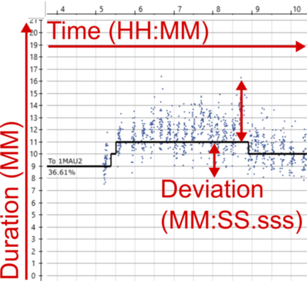
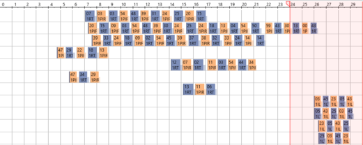
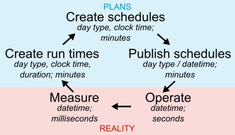

---
output:
  pdf_document: default
  html_document: default
---
```{r init-libs-time, echo=FALSE}
library(readr)
library(knitr)
library(magrittr)
```

# Time in transit data {#time}

Collective transport seems like a relatively simple thing: buses and other vehicles run from stop to stop, at scheduled clock times that pretty much remain the same from day to day.
Sometimes they run a bit ahead or late from the schedule.
In reality however, the temporal and spatial aspects of a transit system are more complicated than that.
I'll discuss my views of the temporal aspects in transit data modelling in this post, and the spatial aspects in the next post, Chapter \@ref(place).

::: {.noteblock data-latex=""}
I'll be using the Finnish date format like `1.12.2021` in this text.
It follows the order `day.month.year`.

Clock times, in turn, are expressed here like `11:35 (HH:MM)`, `11:35:14 (HH:MM:SS)`, or `11:35:14.967 (HH:MM:SS.sss)`.

Everything is handled in local Finnish time, unless stated otherwise.
:::

::: {.tipblock data-latex=""}
I'll be giving some tips for data modelling from my limited experience.
They are best applicable to the PostgreSQL database environment, but similar concepts can of course be found in other environments too, such as R and Python.
:::

*Time* is an overloaded term - it has many meanings and uses.
In our organizational language at HSL, as well as elsewhere, each meaning is most often well understood from the context.
At the same time, there are many caveats and possibilities of at least slight misunderstandings with the concept.
Especially, in my view, when an experienced transit planner or analyst discusses our everyday business and related data models with a "newcomer", such as a software developer still onboarding a project, it typically takes a lot of time to unpack the exact definition of time in each context and to get both on the same page.
It often feels overwhelming for a newcomer to read all the meanings from a list of standards, for instance, and on the other hand, trying to skip that by simplifying things and making assumptions by "common sense" just seems to postpone the inevitable effort of confronting the complexity of time in transit modelling to a later phase.
At least at HSL, many essential definitions of time aspects - overlapping or contradictory ones as well - have not been thoroughly documented and officially agreed upon, which makes learning them pretty hard.
I think this is because most experts already share a similar mental model about them, and are able to use a common language understandable enough, and all of these have evolved over the years;
in the end, for an expert like this, it feels like there is always much more critical work to do than write down such "self-evident" things.
But then, every time we start a development project with external non-transit experts, or hire a new planner or analyst and wish to onboard them to the everyday work, we have to confront the fact that we have a whole lot of undocumented knowledge like this, and even the experienced ones do not in fact share *exactly* similar mental models.

Well, I try to contribute to explaining the dimensions of time in transit planning and modelling a bit.
My views are anything but exhaustive, though.

Let's think of a transit trip of HSL bus line 23, starting at 12:23 at Central Railway station on 11.12.2021.
It has a schedule - planned departure, possibly even separate arrival times, at each stop - and hopefully, a vehicle can realize the scheduled service at real times that follow the planned times within a satisfactory variation.
What aspects of time are involved, and where do they originate from?

## Times, durations, deviations

On that very day, both the scheduled and realized stop times can be thought of as *absolute timestamps*.
That is, they have a date and a clock time part, and they happen in a time zone, namely `Europe/Helsinki`, or `GMT+02`, in this case.
This means we could also convert those timestamps to *UTC time*, and in fact, computers do that most of the time - they store absolute timestamps as decimal seconds starting from the so-called [UNIX epoch](https://en.wikipedia.org/wiki/Unix_time), UTC midnight of 1.1.1970.
For instance, the departure time `11.12.2021 12:23:00` would be stored as `1639218180.0` UNIX seconds.

However, planners do not create absolute timestamps for scheduled trips by hand.
They are generated otherwise.

First of all, a transit route during an operation season (such as winter 2021/22 or summer 2022) requires *run times* for different basic day types.
Typically, the run times are created separately for three weekday types: Mon-Fri, Sat, and Sun.
This is because the real run time patterns from stop to stop throughout the day tend to vary most between these three classes, but not so much between individual working days, for instance.
The COVID-19 pandemic has probably changed this a bit, though, as there seem to be more random, interesting travel peaks on certain individual weekdays, which makes it a bit harder than before to plan reliable run times.

A run time means the *duration* it takes to operate from a stop to another stop.
Duration is a continuous value, typically measured in decimal minutes or seconds.
The latter is most common in computer systems, and it can be easily decomposed into components for better readability:

```{r duration-example, include=TRUE}
dur_s <- 324.97
sprintf('%02d:%02d:%.3f',
        dur_s %/% (60*60), # hours
        dur_s %/% 60,      # minutes
        dur_s %% 60        # seconds
)
```
Note that the duration seems like a clock time, but it is not bound to any point in time, unless such a context is actually provided.
In the context of run time planning, durations of a stop-to-stop segment are bound to time of day, since real run times tend to vary during the day due to various reasons, such as other traffic, more or less passengers being served at stops, and so on.
Thus, the *run time depends on the time of day*.
Wouldn't it be practical if we didn't use two meanings of *time* in the same sentence, and could instead speak of *duration* when meaning the run time...?
Well, that is against what feels common and familiar.

Actually, it makes no sense to plan run times for *every* stop along a route.
In the big picture, run times tend to behave in a linear manner over multiple adjacent stops, as long as the traffic environment and other affecting factors remain pretty similar.
Moreover, variability of planned vs. real stop times of less than a minute is considered insignificant at least in street transport (bus & tram in HSL area):
although real run time *measurements* have the accuracy of seconds, planned run times are defined in integer minutes, since the public schedules are shown at the same accuracy, and it would not be worth the effort to create run times and schedules at the precision of a second.
(In modes of a higher right-of-way, such as metro and train, this makes more sense, since they can better adhere to schedules with margins of seconds rather than minutes, as there less external factors disturbing them.)
Instead of individual stops, we plan run times for segments of multiple stops, i.e., between *places*: a stop is assigned a *place* label, if there's a change in the run time behaviour significant enough so it makes sense to start a new segment for separate run times.
Typically this can happen when moving from traffic light filled urban area to a highway, or whenever a stop is defined as *timing stop*, i.e., the vehicle must wait until the scheduled departure time before proceeding again.
Read more about stop places in Chapter \@ref(place).

The run time of a *segment* between places is "spanned" over all the stops belonging to the segment, and stops in between thus get linearly interpolated duration values calculated from the beginning.
If the segment run time is short enough and stops are close to each other, then adjacent stops might get seemingly same duration values, and eventually the same departure and arrival times, since the planned time values are coerced to whole minutes.
Keep this in mind when examining the public stop schedules or wrangling GTFS stop times, for instance.

After run times of a route have been created for a season and the basic day types, it's time to create the schedules.
In the schedule of a route (and direction - typically a route has two direction variants), we have *trips* that follow the pattern of successive stops.
To achieve *clock times* at stops for each trip, we need two things: firstly, an *initial start time* of the trip from the *first stop*, and secondly, the *run times* for the pattern of stops that we just created.
Clock times are then produced by simple addition of the initial start time and cumulative run times:

```{r runtime-create-example, echo=FALSE}
read_csv('extdata/runtime-create-example.csv') %>%
  suppressMessages() %>%
  kable()
```

Although at HSL we tend to generate the stop times like above, using the first stop as a reference, it is possible to do it other way around too, calculating the times "backwards" from the last stop, once that last arrival time has been fixed to a desired clock time value.
That would make sense if it is important that the trips arrive accurately to a train station to allow reliable transfers from bus to train, for instance.
However, "initial start time + run times" is the default method.
Moreover, a planner can add extra time for individual trips at certain stops by hand, if needed:
this can sometimes be an easier way to improve the schedule adherence of individual trips than going through the run times -> entire schedules process again.

```{r runtimes-example, echo=FALSE, fig.cap='Example runtime analysis from Hastus. Three different dimensions of time annotated.'}

```

Figure \@ref(fig:runtimes-example) is a screenshot from Hastus run time analysis and planning tool, where the small dots show measured run times on a stop-to-stop segments, and the black line shows a fitted run time *plan* that can vary during the day.
The planned run time is defined in integer minutes and saved to the Hastus database so it is then used as a basis for schedules of the day type in question, and considering time of the day, depending when a scheduled trip passes the segment.
The percentage value shows the proportion of observed run times that are shorter or equal to the planned run time: i.e., in the example, 37 % of the trips would have passed through the section on time or faster.

I have indicated three different aspects of time that can be found in Figure \@ref(fig:runtimes-example):

1) Time of day, or clock time, is presented on the X axis.
Run time is dependent on it - not inherently, but due to typical time of day bound phenomena, such as volumes of other traffic.
2) Run time can be seen on the Y axis, in minutes.
As indicated, I'd like to call it *duration* to not confuse it with *time* as *clock time*.
3) *Deviations* of duration can be seen on Y axis as well, when comparing observed and planned run times.
In general, a deviation could be calculated as `duration +- duration`, `time +- duration`, `duration +- time`, or `time +-time`.
Even though it can be measured with same units as duration - such as in minutes, or in case of observations here, precisely in minutes, seconds and milliseconds - I think deviation is conceptually different from duration.
Whereas duration describes how long an actual event takes, how long a feature is valid, etc., deviation describes the *time difference* of instants or durations of comparable events.
I'll discuss duration a bit more in Part \@ref(plan-vs-real).

## Operating days and 30-hour clock

The concept of *date* in a given time zone is a pretty simple one: a new date, `+1 day` to the previous one, begins every midnight at 00:00.
Unfortunately in transit scheduling, it's not as simple as that.
Consider a trip that starts in late Friday evening and has a schedule like this:

    stop_1 23:49
    stop_2 23:54
    stop_3 23:59
    stop_4 00:01
    stop_5 00:05

In schedule planning, every regular trip originates from a vehicle schedule that is required to have a *day type* attribute: usually the day type can be something like `Mon-Fri`, `Sat`, `Sun`, or a special day type, such as `Independence Day`.
The day type is used to assign the trips of a vehicle schedule to real calendar dates, i.e., an identical set of trips of a `Mon-Fri` vehicle schedule is assigned to every working day during the season, such as our current winter operation season 16.8.2021-19.6.2022.
This way we don't need to assign the trips manually to each date, and operators and passengers get schedules that are easy to understand, as well.
(Day types can override each other, meaning in practice that if `Independence Day` is assigned to a normal Monday, then that special day type is prioritized instead of `Mon-Fri`, except if a vehicle schedule has no separate version specified for that special day type, then it still follows `Mon-Fri` trips. I'll not go deeper into this here.)

Now, you see that the calendar date clearly changes after the third stop in the example above.
Still, the example trip must be assigned to one vehicle schedule and day type exactly - we cannot split it into two trips, as it must be a continuous trip run with the same vehicle, from both operator's and passengers' perspective.
And our planning software (Hastus) obviously does not allow "jumping" backwards in the timeline during the trip.

The practical answer is *operating day*.
The main point is that *an operating day spans over the real midnight*, allowing trips to be partially or entirely assigned to the day type that in reality refers to the previous calendar date.
In vehicle schedule planning, it means a timeline of a day like this:

```{r hastus-30h-example, echo=FALSE, fig.cap='Example of 30-hour timeline in Hastus. Trips after 24:00 get will actually start after 00:00.'}

```

Hastus uses the definition of 30-hour operating day and therefore allows trips of the "previous day" to last until 6:00 on the next real day.
Figure \@ref(fig:hastus-30h-example) shows a practical example of this: a block graph, where successive trips are assigned to "blocks" (set of trips for a vehicle), and the times of an operating day are presented on a 30-hour timeline.
HSL, on the other hand, tends to define that an operating day starts at 0:00 and end at 4:30 on the next calendar day: this is due to practical reasons, as there is usually as little traffic as possible going on just between 4 and 5 in the morning.
But this is more of a practice than an exhaustive definition, and it is not enforced technically, as far as I know: any trip that is valid in Hastus' timeline will do.
30-hour operating day is also used by GTFS, so I think it's a reasonable default length to assume when considering transit times in data models, unless stated otherwise.

In addition to stretching the timeline needed for the trips of a day type a bit, there is another benefit from operating days: entire trips can be defined after 24:00, if they are only required on Friday or Saturday nights, or night before a holiday.
Although it would be technically OK to define them on the next calendar day after 00:00, this would not be logical to the passengers: 30-hour operating day allows such trips to be visible in the public schedule tables under Friday, Saturday, and so on, not "randomly" under the next weekday.
In Figure \@ref(fig:hsl-night-sched-example), stop times of line 23 after 0:00 have originally been modelled as `> 24:00` times, this way they are kept under the Mon-Fri day type and not shifted to the next visible day type, Sat.

```{r hsl-night-sched-example, echo=FALSE, fig.cap='Example of public schedule of line 23 in night time. Screenshot from reittiopas.hsl.fi.'}
knitr::include_graphics('fig/hsl-night-sched-example.png')
```

Obviously, operating days and calendar days go hand in hand, as long as both start in the midnight, but then there's an overlap in the night: the time range `00:00-06:00` of a calendar day `5.3.2021` equals both `00:00-06:00` of `5.3.2021` and `24:00-30:00` of `4.3.2021` measured as operating days.
We can thus note that the conversion from operating days and 30-hour times to real timestamps is irreversible for times between 00:00 and 06:00.
This introduces a challenge in data modelling: whether to express days and times as operating days and 30-hour times that represent well the planning context of transit, or as real datetimes/timestamps that are technically unambiguous, since they refer to exactly one point in the real timeline.
Based on my own experience, I'd avoid this caveat by using operating days and 30-hour times as far as possible on the *planning side*, and keep using real datetimes whenever *real operations*, such as operated trips, are modelled - since real events tend to happen in a continuous, unambiguous time horizon.

One more note to make the concept of operating day not too simple: [GTFS Reference](https://developers.google.com/transit/gtfs/reference#field_types) does not refer to operating days but *service days* - which makes as perfectly much sense, too, in my view.
This is just one of the many examples how in transit modelling, a term can often have synonyms, none of which is necessarily the absolutely correct one to use.
The dominating one often tends to be determined by traditions and practices of organizational language, and I haven't seen a standard document either that would manage to cover all such cases.

One more, even more important note from GTFS: I only just learned that Google tells there that *the time is measured from "noon minus 12h"*.
Why?
Because if you want to take *daylight savings* into account correctly, you cannot actually use midnight as the reference, as timezone shifts tend to be done at 3:00 or 4:00 in the morning, at least in Finland.
Using the midnight reference would then mess up matching calendar and operating days on those dates when the shifts happen.
This new information blowed my mind, and I still need some time to refresh my conceptions and opinions on how to correctly model transit date and time data on the planning side...

## From planned to real times {#plan-vs-real}

On the planning side, we first defined clock times (such as trip stop departure times) for vehicle schedules specific to generic day types, which we then converted into clock times per date, i.e., datetime values by using the information on what calendar dates correspond to the day types during the operation season.
Right after we generated the run times using seconds-precise run time measurements from past real transit trips, we have in practice operated at the precision of integer minutes: i.e., with clock times like `11:03`.
Our systems would allow operating with seconds as well, and this is actually done when planning schedules for the subway mode, but in bus and tram planning, trying to determine things beforehand at that level of detail would make little sense.

The temporal dimensions in the planning domain are packed with human-centered time conceptions, like "calendar", "special days", "day of week", "rush hour", and with time values coerced to limited precision such as minute and whole date.
As soon as we move on to the real world - *"realization context"* - things start to actually happen at exact time instants that can be put on a continuous timeline, measured with concepts like UTC Unix time.
I think this conceptual difference is good to understand when creating data models specific to each context, and especially when integrating these two contexts.
Our systems and software tools provide us with great methods for coercing time values, "bucketing" them into classes like hour of day or quarter of the year, taking time zones into account, and so on.
These all are widely required when matching planned operations to realized ones and vice versa.
In my experience, the main part that often fails there is the human actor:
we tend, again, to oversimplify things at intermediate steps so they "look and feel nice" - this often means things like dropping time zone attributes, coercing realized timestamps to integer minutes, or exporting planned transit trip times in 24-hour clock system so they are in the same scale with real 24-hour times, although this conversion ultimately results in loss of information, like I mentioned above.
There's probably no silver bullet to this topic either, but I think it helps a lot if we're able to identify the domain we're dealing with in each case, take the time to really consider whether accurate UTC times or coerced "generic" time components are the right answer - and thoroughly document these thoughts and design decisions along with the data model we create.
In this fields, misunderstandings and wrong assumptions are likely to happen otherwise. 

Time *deviation* is an especially useful concept for comparisons between planned and realized transit times - run times (durations), clock times, or both of these.
Many performance measures in transit analysis are based on schedule adherence, which requires comparison between planned and realized stop departure and arrival times, for instance.
In such comparisons, different precisions of the planning and realization domains must be considered: for instance, if stop times were planned with whole minutes, it does not make sense to consider a deviation of `+24 s` as real delay, at least a significant one.
For these situations, a strategy should be developed for dealing with different precisions.
Sometimes it may mean rounding, sometimes using `floor` and `ceiling` functions, for example.

Deviations are useful not only between these domains but also within them.
I would for instance think "headway" as one kind of a deviation - the difference between successive trips.
Headway is, of course, measured either within planned or realized trips.
(From passenger's perspective, headway could rather be a *duration* - how *long it takes* to wait for the next vehicle.)

Deviations are most practically measured in hours, minutes, and / or seconds, and stored as decimal seconds internally.
They are technically similar to durations, but conceptually, in my view, *duration* measures a different thing - it focuses on an event, rather than the difference of two comparable events.
This is however a matter of taste and interpretation to some extent:
for instance, we could as well think that two clock times at successive stops are "comparable events", even though they result in a run time describing the stop-to-stop "event".
With this in mind, I'm not able to give exhaustive definitions for my conceptions of *duration* and *deviation*.

```{r plan-reality-loop, echo=FALSE, fig.cap='Feedback loop of transit planning and reality. Aspects and precision of time in each step.'}

```

Figure \@ref(fig:plan-reality-loop) summarises the connection between planned and real transit times, and demonstrates two things:

-   firstly, how the real, actually operated transit service affects the planning through measured run times, and how planning then again creates the basis for real transit operations and times through schedules;
-   secondly, what aspects of time are applied at each phase of this loop, and at which precision.

::: {.tipblock data-latex=""}
**Tips for data modelling**

-   In planning context, keep using operating days and 30-hour times if you possibly can: they can be converted into real datetimes unambiguously, but not vice versa.
-   In real operations context, it is wise to use real datetimes, otherwise you can easily mix up whether an event happened today or yesterday night. Remember that you can still, for example, easily match a real trip to the planned one by using the conversion from operating to real days mentioned above:

```
Planned trip starts at 4.5.2020 25:01:00 (operating day)
Real trip started at 5.5.2020 25:02:03 (real day)
> Set these to the same timeline by converting the planned trip:
  date 2020-05-04 + 25 hours + 1 minute + 0 seconds == 5.5.2020 01:01:00
```

-   In Postgres, do not try to use the `TIME` (24-hour clock time) type for 30-hour operating times. Instead, use `INTERVAL` that makes it easy to store time values starting from midnight as decimal seconds while representing them as `HH:MM:SS`. Moreover, addition `DATE + INTERVAL` results directly to a correct `TIMESTAMP` value, and of course takes into account `> 24:00:00` times, resulting in a timestamp on the next calendar date. Just remember to add the correct timezone information when converting to `TIMESTAMP WITH TIME ZONE`!
-   In R when using packages such as `{lubridate}` or `{hms}`, as well as Python, conventional time representations will not support 30-hour clock times either. Find something comparable to the Postgres' `INTERVAL` type - probably you'll have to mess around with `Date` and `difftime` types together in R. I've often stored the times as plain decimal seconds from midnight, and used a custom formatter function that can render the values as 24+ hour `HH:MM:SS(.sss)` labels, when creating plots with a 30-hour timeline, for instance.
:::

## Human times

Transit planning is full of time concepts that have nothing to do with time as a *physical* phenomenon while they are extremely important to *humans*.
I mean things like "calendar day", "week", "rush time from 7 to 9 in the morning", and so on.
Knowing no official or otherwise better term for these, I call them "human times".
They are, in a way, just conventions to label certain points or ranges in the continuous, physical timeline, but as you can guess, the topic is not as simple and nice.
Typical human time labels are already given as examples here and there around this text, so I'm not going to create a separate list of them here.

I would classify human times at least into two different types:

1) The ones that are so widely used and commonly agreed upon that they have evolved into official standards, such as [ISO 8601](https://en.wikipedia.org/wiki/ISO_8601).
An example is the Gregorian calendar system that provides us with dates, months, days of week, and when each date starts and ends exactly, depending on the time zone.
2) The ones that vary so much between organizations, situations, and users interpreting them that it has at least so far made little sense to try to unify them into common standards.

Then there are the ones that don't necessarily fall clearly into any of the two categories: I think for example that public holidays in Finland are easily found from official sources, but I'd not rely on standards or software libraries giving me an exhaustive mapping of those holidays to calendar dates, so some human effort and checking would be needed in this case.

The "standard" human times are widely built into software libraries and methods, so most of the time, we can easily derive them using date and/or time values, and a suitable method.
For instance, a date and a "give me the ISO day of week" function together tells me easily the day of week of a date, in the system that is used in Finland (week starts from Monday, days are numbered starting from 1).

The second category, in turn, is more of a messy world that requires human effort.
Special days should be defined and stored somewhere, a developer should know what exactly "rush hour" means in terms of clock times during a day, and so on.
I think this is a critical area where teams, organizations, and entire domains such as collective transport planning and management have developed a lot of knowledge that often tends to live in human heads - nice, but risky if we wish to onboard new experts easily.
The more we could develop common understanding in format of written documentation, the better.
On the other hand, not everything can be standardized and made into unambiguous, shared definitions, as long as we depend on human communication and interpretation.

I tend to consider human times as "labels" that are assigned to certain intervals on the continuous (UTC) timeline.
For instance, "tomorrow" said on 10.12.2021 in Finland refers to UTC interval `[2021-10-12T21:00:00Z, 2021-11-12T21:00:00Z)` (at integer second precision);
and "months of 2021" similarly refer to *multiple / recurring* exact datetime intervals.
In this integration between human and "absolute" times, it is worth noting that intervals of certain *duration* do not always transfer nicely to human times.
For instance, months can be 28 to 31 days long - so, to build full calendar months on top of individual dates, adding a constant of 30 days is not enough!

Another note is that these human times and their conversion into exact time intervals can be difficult in comparison situations, where we want to set things to a shared scale.
A typical example is when we want to visualize some trend over days between two or more years:
in that case, it makes little sense to handle dates through weeks, days of week, and days of month.
Instead, it is better to use the ordinal day number within a year, so we get each day to a scale from 1 to 366, and the trends during each year can be nicely compared.
In contexts other than this, day order number during the year is less intuitive for humans.

::: {.tipblock data-latex=""}
**Tips for data modelling**

-   Think carefully before adding human time label fields to your data, like `monday`, `is_weekend`, or `is_morning_rush_7_9`.
Can these be derived directly from your original date, time or datetime values?
If yes, why not preserve the original values and render any human time labels on the fly?
-   Time-related methods and libraries in various programming languages and environments provide excellent ways for extracting necessary parts from dates, times, and datetimes on the fly.
Get to know PostgreSQL [`EXTRACT`](https://www.postgresql.org/docs/current/functions-datetime.html#FUNCTIONS-DATETIME-EXTRACT) function: `extract(hour FROM tscolumn)` to get hour of day, `extract(isodow FROM date)` to get day of week with `1 = Monday`, and so on.
-   For non-standard human time labels, such as your custom "periods of day" like `morning peak, midday, afternoon peak`, think about creating custom functions or lookup tables that help you rendering those labels for date/time/datetime values.
Avoid repeated, error-prone use of complicated formulae.
Often, management of these special labels is built as part of a transit data model:
an example is the special day type management in HSL Jore3, where a lookup table, administered by a human, is needed to match day type labels for exceptional service patterns to exact calendar dates.

:::

## More and more time dimensions...

So far, I've discussed different ways to express time in the "business context" of transit data, in other words, how real-life time concepts are converted into data model features.
However, I think that almost any live in at least two different *time horizons*, or *dimensions*:

1) Business time, e.g. "this trip has a planned initial departure date and clock time";
1) Metadata time, e.g. "this trip entry for the next summer was created a month ago", or "the trip departure time was corrected today".

If we want, we can split these two horizons into further subclasses.
For instance, business time could include *planned* and correspondingly *realized* times, which can be *event times* (happening at a certain instant, or between two instants), or especially for planned features, *validity times* (corresponding to features that seem static but actually change over time, such as stop locations).
Metadata time could include time types like feature *creation*, *modification*, *deletion*, or in case of capturing real-time data, *recording* times.
I understand *creation* and *recording* a bit differently, since the first could refer more to a human interacting with a data system and creating features, while the latter comes from automation as the system stores real-time data (with some latency).

Below is an example of multiple time dimensions in the same context.
Let's assume that I did the following as a planner:

-   On 9.12.2021 (*planning process time*), I finalized a vehicle schedule for route 23 that will be effective between 19.6.-15.8.2022 (*validity time*).
-   The route version used there is valid from 1.9.2021 on, with no upper limit (*validity time*), and it uses stops and links that were last modified on 13.8.2021 (*feature modification time*).
-   I upload the schedule to our transit registry Jore, and it is published to the operator and to the public in Spring 2021, some months before the summer season.
Now the *planned event times*, such as departure and arrival times at stops, are known and expected publicly.
-   Then, from 19.6.2022 on, vehicles run the scheduled trips, and we get *realized event times* such as actual departure times from stops, and run times from stop to stop.
-   Our AVL system records those realized times as events from the vehicles.
Because of inherent latency in the vehicle computers and in the network, the *recording times* of that data will differ slightly from the corresponding realized times.

The exact terms for different time dimensions are kind of improvised - I haven't learned about good common standard terms for them, or about a classification exactly like this - but I hope the idea is clear:
planned and realized times are not the only ones a planner or an analyst should be aware of.
There are more dimensions affecting and interacting with each other in data models for both planned data, such as the transit registry Jore3 (and upcoming Jore4), and realized data, such as AVL data warehousing.
In my view, all of the time dimensions included in my example above should be taken into account, ideally, but it is of course not quite simple.
Imagine a system where *all* the modifications are tracked, and old versions of any modified feature is tracked;
imagine that in addition to route versions, every network part such as stops and links are versioned, even using second-precision timestamp ranges, if not date ranges;
and imagine what a mess it would then be to take a track of AVL data of a single realized transit trip, and try to join back every planning-related data type to that track, such as contracts, schedules, operation prices, stops, links - and any modifications to these in between - such that the result is consistent and unambiguous.

It would be difficult, indeed - but so is our life with the current data models, where the designers have made simplifications and straight assumptions about planning processes and transit operations reality in rather critical spots.
Maybe the most typical example is that in the current Jore3 registry, we have no network versioning:
this means that in case of a roadwork, for example, stop locations must be changed and links created, split, and modified *ad-hoc*, and no "old versions" of those network features are saved anywhere.
Now, this of course affects how any route version that was effective before those stop and link changes looks like, how long the route geometry is, and so on.
Go and try to join positioning data from realized trips to the route geometry representation as it was meant when planning the trips - not going to work.
And maybe the worst: the network changes must be done exactly the same day they start in the real life, they cannot be scheduled beforehand.
So, simplification on the data modelling side ("only one representation of the network is preserved at each moment") results in error-prone, laborious, not-so-simple work by humans.

I don't know the answer, the golden path, how much complexity of a real-life transit system a data model should catch - it depends on the user requirements (that are often really difficult to determine upfront, though) and resources available for both development and maintenance.
However, I would encourage dev teams to embrace the need for multiple time dimensions, coming from different contexts such as validity of a planned object or technical modification times, instead of starting to oversimplify things the very second the reality looks like hard and uncomfortable to model.

We don't have to reinvent the wheel of time and time range modelling for every database table:
instead, it'd be better for a developer to create a general mental model of how time instants, durations, validity times, their overlaps or gaps, and other substantial time-related concepts can be implemented in any data model, and in a given technology, such as PostgreSQL.
Being familiar with such concepts and tools that enable implementing them easily, a developer is much more prepared to confront the complex reality of things happening on a timeline.
Or, I'd say that the timeline as a physical phenomenon is anything but complex, but the complexity and difficulty comes from all the meanings and conventions that humans have assigned to the timeline.
This all requires, of course, a lot of practical experience, trial and error over years, and on the other hand, learning about tech and theory.
I've already spent many years trying out dramatically failing data models, also over-engineered and needlessly complex ones, and countless hours in documentation pages such as the one about PostgreSQL [time and date functions](https://www.postgresql.org/docs/13/functions-datetime.html).
Now I feel like I've gathered a bit of information on how and how not to do things with time in data.

::: {.tipblock data-latex=""}
**Tips for data modelling**

-   There are multiple design patterns to apply to feature versioning over time.
One could preserve the latest feature (e.g., row in a database table), and upon any modification, discard the old row or archive it to a different location;
or one could build the versioning into the data table using timestamps or timestamp ranges, for example.
-   In most cases, I would start from the latter example: in the context of a relational database, design your table as usual - decide a suitable primary key, or multiple ones.
E.g., integer `stop_id` for transit `stop` table.
Then, add the time versioning layer: a date, timestamp, date range, or timestamp range column.
Add that as part of the primary key.
If using the range type, think about using an [exclusion constraint](https://www.postgresql.org/docs/current/sql-createtable.html#SQL-CREATETABLE-EXCLUDE) that prevents range overlaps between rows, in addition to row unicity over the primary key column(s).
-   If using date, make sure you know whether you want to refer to real dates or operating days in transit context.
If using timestamps, make sure you know whether you want to refer to local or UTC time.
(UTC time is often a wise choice in metadata time).
-   If the time versioning of the features does not need to support *gaps between versions*, then simple timestamp or date should be enough: successive timestamped versions of, say, a `stop_id` then form a continuous history.
But if this history needs to support gaps, e.g., a stop is not available on a certain time range, then date or timestamp range can be better, since you can cap the validity of a version to end before the version validity starts.
-   Often, separate date or timestamp columns such as `starts_from_utc` and `ends_to_utc` for validity ranges are preferred to range types.
I like single-column time range types, though, since they allow flexible use of [range-specific operators](https://www.postgresql.org/docs/14/functions-range.html).
Lower and upper values of ranges can always be exposed to a database user through a view.

:::

## Don't forget the time zone!

This is something I already mentioned about above, but let's discuss it as a final topic:
we always have to take into account that in Finland, we're not living in the nice and universal UTC time but have to deal with +2 or +3 hours offset to the UTC time, and that changes according to daylight saving time (DST) changes every March and October.
Considering time zones in programming is [pretty hard](https://xkcd.com/1883/).
I think there are hardly any shortcuts in this topic.

It is often said that timestamp / datetime values should be stored in UTC time (e.g., as UNIX decimal seconds, internally) whenever possible.
This generally makes sense, since with UTC time, we can be sure to have no ambiguity due to daylight saving time (DST).
However, UTC kind of represents the "physical truth" of continuous time, and is great at pointing at exact instants or ranges in time;
but humans use more complicated interpretations and derivatives of time, as we have seen above.

For instance, the calendar dates, operating days, and clock times are in the transit context are always bound to the local time.
If we were to force Finnish clock times to UTC times, it would cause shifts back to the previous date, and without the date part attached (remember, date is not there yet with vehicle schedules specific to day types, for instance), we'd lose information.

Luckily, modern programming languages and libraries have advanced methods to handle time zone information and keep it attached to the time values themselves all the way from, say, raw data to a localized UI.
But, where this is not possible, such as with `date` data types often, the programmer must be well aware of the time zone that we're handling each time, or wish to handle.
I think generous use of words *UTC* and *local* together with date and time variable names and terms in documentation would not be a bad habit.

::: {.tipblock data-latex=""}
**Tips for data modelling**

-   Instead of manually converting to UTC time, store absolute datetime values *with* the timezone part - this could be the offset such as 'GMT+02', or standard name such as 'Europe/Helsinki', depending on the system.
In PostgreSQL, this means using data type `TIMESTAMPTZ / TIMESTAMP WITH TIME ZONE`.
-   You can then render datetimes stored like above in any timezone you want.
In PostgreSQL, you can ensure a certain timezone like this: `"tstz col name" AT TIME ZONE 'Europe/Helsinki'`.
-   Be aware that client locale settings - in a web browser, in `psql` Postgres prompt, etc. - often affect in which timezone the timestamps are rendered!
If you don't explicitly state the timezone like above, you may get different results on your local machine and on a virtual server that lives in UTC time, when querying the date part from a datetime, for instance: `extract(date FROM timestampcolumn)` in PostgreSQL.
-   Often you cannot store the time zone information along with a time type.
With PostgreSQL data types useful for transit times, this applies to `DATE` and `INTERVAL`, for instance.
In these cases, indicate that local time is meant, by naming the objects like `operating_date_local`, or stating this clearly in the documentation.
:::

## Conclusion

Above, I've gone through a number of aspects that can be used to describe and examine the temporal dimensions of collective transport planning and operations:

-   Durations, and how to connect times and durations
-   Real days and operating days
-   Real and 30-hour clock times
-   Absolute timestamps (or datetimes)
-   Time ranges
-   Intervals and "civil" general intervals such as "morning peak"
-   Deviations (or time differences)
-   Metadata times and temporal feature versioning
-   Time zones

This all seems like, and to some extent is, a mess.
Let me cite a great blog post about [handling time zones in Python](https://www.caktusgroup.com/blog/2019/03/21/coding-time-zones-and-daylight-saving-time/): *"Working with human times correctly is complicated, unintuitive, and needs a lot of careful attention to detail to get right"*.
Simplifying the concepts of time and in transit too much, and underrating their significance, can lead to concept and data models that cannot catch the complexity of transit, though.
In the end, time is *technically* a pretty simple concept: everything happens on a continuous timeline, and humans tend to assign certain meanings to points or ranges on that line, such as days of week, morning rush hours, or start of a year.
In many cases, using known reference points in time + doing additions, subtractions and other maths with decimal seconds works quite nicely, and the rest is just visualizing those seconds values in an understandable manner.
Just be aware of the context - whether you are dealing with datetimes, dates, clock times, durations, intervals, deviations, or with some other weird aspect to time.
And whether you are dealing with "human time" or time as a continuous physical phenomenon.
I know it's easier said than done.
Anyway, in my view at least, time is a fascinating part of transit data modelling in its simplicity and complexity at the same time!

::: {.tipblock data-latex=""}
**Reading tips:**

-   PostgreSQL [date/time types](https://www.postgresql.org/docs/current/datatype-datetime.html)
-   R [`{lubridate}`](https://lubridate.tidyverse.org/) library for dealing with date and time types - this library provides excellent methods and concepts for time aspects, with a partly similar classification I have applied here.
However, `{lubridate}` does not natively understand 30-hour clock times of the transit business, for instance, so you still have to apply your custom chunks of code there...
-   [GTFS Reference](https://developers.google.com/transit/gtfs/reference) is a great place to learn how dates and times can be handled in planned transit and passenger information context
-   Try out the [Digitransit GraphQL API](https://digitransit.fi/en/developers/apis/1-routing-api/1-graphiql/) to learn how timestamps, durations, and deviations between planned and real times are handled behind [HSL Route planner](reittiopas.hsl.fi/), for example.
You'll find things such as wrangling with "integer seconds since midnight".

:::

\newpage
